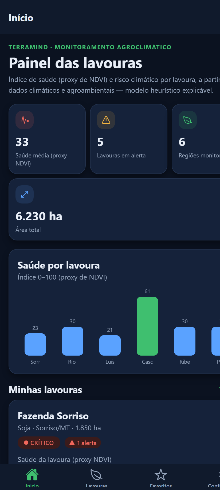
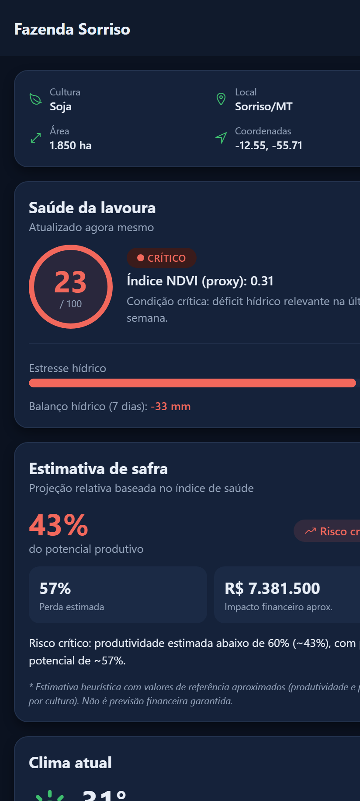
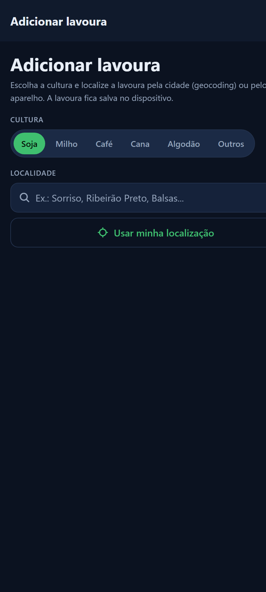

# 🛰️ AgroSat — Monitoramento Agroclimático de Lavouras

**AgroSat** é um **MVP mobile de apoio à decisão agrícola** (React Native + Expo SDK 55 + TypeScript). Ele usa **dados climáticos e agroambientais** para calcular um **índice explicável de saúde da lavoura (0–100)**, antecipar **riscos climáticos** e estimar a **safra**. O índice é **inspirado no conceito de NDVI**, mas nesta versão funciona como um **proxy agroclimático** — **sem processamento real de imagens de satélite**.

  

---

## 🎯 Problema

No campo, **estresse hídrico, geada e seca** muitas vezes só são percebidos quando o dano já é visível. Falta uma ferramenta simples que transforme dado ambiental em **decisão preventiva**.

## 💡 Solução

O AgroSat reúne em um app: o **índice de saúde** de cada lavoura, o **risco climático** dos próximos dias, **alertas** e uma **estimativa de safra** — ajudando o produtor a **priorizar onde agir** antes do prejuízo.

## 🛰️ Relação com a indústria espacial (honesta)

- Inspiração direta em **sensoriamento remoto** e no **NDVI**.
- Uso de **dados ambientais e climáticos** de modelos meteorológicos que **assimilam observação de satélite** (Open-Meteo).
- Índice de saúde como **proxy inspirado no NDVI** (não NDVI espectral real).
- **Roadmap:** integração com **Sentinel-2** para NDVI real.

> Transparência: o app **não processa imagens de satélite** nesta versão. A relação espacial é por **dados e conceito**, não por processamento espectral.

## 🌱 ODS da ONU

- **ODS 2** — Agricultura sustentável
- **ODS 9** — Indústria, inovação e infraestrutura
- **ODS 13** — Ação contra a mudança climática

---

## 📱 Funcionalidades

| Tela / Recurso | O que faz |
|---|---|
| 🏠 **Dashboard** | Indicadores (saúde média, lavouras em alerta, área total), **gráfico de saúde por lavoura** e imagem astronômica da NASA. |
| 🌿 **Lavouras** | Lista com **busca**, **filtro por status** e **ordenação**. Pull-to-refresh. |
| ➕ **Adicionar lavoura** | Por **cidade (geocoding)** ou pelo **GPS do dispositivo** ("Usar minha localização"). Salva localmente. |
| 🔎 **Detalhe da lavoura** | Índice de saúde (proxy de NDVI), **estimativa de safra**, estresse hídrico, clima atual, previsão de 7 dias e **alertas climáticos**. |
| 🔔 **Notificações locais** | Aviso no aparelho quando uma lavoura entra em **estado crítico**. |
| ⭐ **Favoritos** | Lavouras marcadas, **persistidas** no dispositivo. |
| ⚙️ **Configurações** | Tema **claro/escuro/sistema**, fontes de dados e equipe. |

### ✨ UX
Dark mode persistido · estados de loading/erro/vazio · gráficos sem dependência nativa extra · pull-to-refresh · navegação tipada.

---

## 🔌 APIs e dados (gratuitos, sem chave obrigatória)

| API | Uso | Chave? |
|-----|-----|--------|
| [Open-Meteo Forecast](https://open-meteo.com) | Clima atual, previsão, umidade do solo, evapotranspiração | ❌ Não precisa |
| [Open-Meteo Geocoding](https://open-meteo.com/en/docs/geocoding-api) | Busca de localidade | ❌ Não precisa |
| [NASA APOD](https://api.nasa.gov) | Imagem astronômica do dia (contexto espacial) | `DEMO_KEY` |

### 🧮 Como o índice de saúde (proxy de NDVI) é calculado
Modelo **heurístico e explicável** em [`src/services/cropHealthService.ts`](src/services/cropHealthService.ts), a partir de dados observados:
- **Umidade do solo** (0–1 cm) atual
- **Balanço hídrico** dos últimos 7 dias = precipitação − evapotranspiração (ET₀ FAO)
- **Estresse térmico** (calor extremo / risco de geada)

Resultado: score **0–100** + valor estilo **NDVI 0–1**, classificado em **Saudável / Atenção / Crítico**. A **estimativa de safra** ([`yieldEstimateService.ts`](src/services/yieldEstimateService.ts)) deriva desse índice a produtividade % do potencial, a perda estimada e um impacto financeiro **aproximado** (valores de referência por cultura).

---

## 🧠 Tecnologias

- **React Native** + **Expo SDK 55** + **TypeScript**
- **React Navigation** (Bottom Tabs + Native Stack, tipados)
- **Context API** + **Custom Hooks**
- **AsyncStorage** (persistência local)
- **Axios** (Service Layer com interceptors, batch e tratamento de erro)
- **expo-location** (geolocalização do dispositivo)
- **expo-notifications** (notificações locais)
- **@expo/vector-icons** (Ionicons)
- APIs: **Open-Meteo** e **NASA APOD**

---

## 🧱 Arquitetura

```
src/
 ├── components/   # Componentes + ui/ (design system)
 ├── screens/      # Home, Regions, RegionDetail, AddRegion, Favorites, Settings, ApodDetail
 ├── navigation/   # Navegadores + tipos de rota
 ├── services/     # API (Open-Meteo, NASA) + regras (saúde, safra, notificações)
 ├── hooks/        # useMonitors, useRegionMonitor, useApod + hooks de contexto
 ├── contexts/     # Theme, Favorites, Regions
 ├── storage/      # Wrapper tipado do AsyncStorage
 ├── data/         # Lavouras pré-cadastradas (seed)
 ├── types/        # Modelos de domínio
 ├── theme/        # Cores (dark/light), espaçamentos, tipografia
 └── utils/        # Formatação e códigos meteorológicos
```

**Fluxo:** `services` → `hooks` (loading/erro) → `screens`/`components`. Estado global e persistência nos `contexts`.

---

## 🚀 Como executar

**Pré-requisitos:** Node.js 18+ e o app **Expo Go** (ou emulador).

```bash
npm install
npx expo start
```

Depois, leia o QR Code no **Expo Go** ou abra direto:

```bash
npm run web       # Navegador
npm run android   # Android (Expo Go / emulador)
npm run ios       # iOS (requer macOS)
```

> Observação: `expo-location` usa a geolocalização do navegador na Web e o GPS no celular. As **notificações locais** funcionam em Android/iOS (no aparelho); na Web são desativadas com segurança.

---

## ⚠️ Limitações honestas

- O índice de saúde é um **modelo heurístico explicável**, **não é IA/Machine Learning** treinado.
- O "NDVI" é um **proxy agroclimático**, **não** NDVI espectral real.
- O app **não processa imagens Sentinel-2/Landsat** nesta versão.
- As notificações são **locais** (no aparelho), **não** push remoto com backend.
- A estimativa de safra é **relativa e aproximada** (valores de referência), não previsão financeira garantida.
- Backend e processamento geoespacial real **não fazem parte** do MVP.

## 🗺️ Roadmap

- NDVI real com **Sentinel-2** / Sentinel Hub
- **Mapa de calor** por talhão e visualização geoespacial
- **Backend** com processamento geoespacial (ex.: PostGIS)
- **Push notifications** remotas
- Estimativa de safra com **dados históricos**
- **Validação** do índice com dados reais de campo

---

## 🖼️ Prints





---

## 👥 Integrantes

| Nome completo | RM |
|---|---|
| Anthony Komatsubara Motobe | RM558488 |
| Evellyn Valencia | RM557929 |
| Felipe Cerboncini Cordeiro | RM554909 |
| Milena Codinhoto da Silva | RM554682 |
| Pedro Henrique Martins Alves dos Santos | RM558107 |

---

## 📚 Referências
- [Expo](https://docs.expo.dev/) · [React Navigation](https://reactnavigation.org/)
- [Open-Meteo](https://open-meteo.com/) · [NASA APIs](https://api.nasa.gov/)
- [NASA](https://www.nasa.gov/) · [ESA](https://www.esa.int/)

> 📄 Material de apresentação em [`docs/pitch.md`](docs/pitch.md) · checklist em [`docs/checklist-entrega.md`](docs/checklist-entrega.md).
